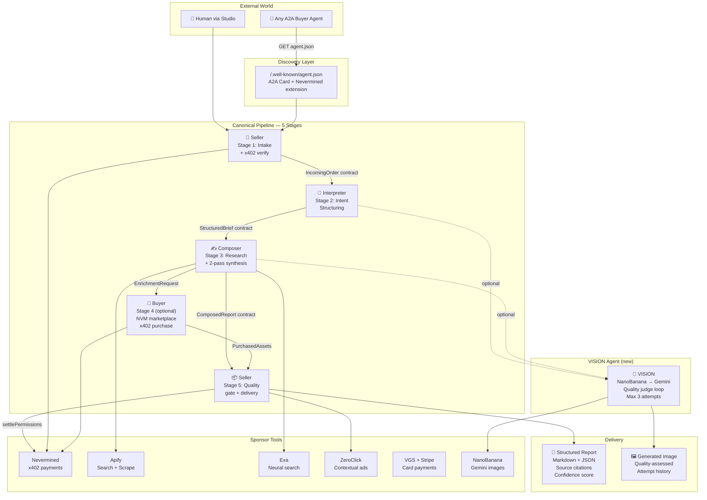

# Auto Business — Autonomous Agent Economy

> **"Four agents that buy from and sell to each other — autonomously, with payment settlement, image generation, and full A2A discoverability."**
>
> Built for the **Autonomous Business Hackathon** · March 5–6, 2026

[](https://nevermined-autonomous-business-hack.vercel.app)
[](https://nevermined-autonomous-business-hack.vercel.app/.well-known/agent.json)
[](https://nevermined.app)

---

## What This Is

A **live, running agent economy** — not a chatbot, not a demo wrapper. Every request — whether from a human in the Studio or an external agent calling our API — flows through a canonical 5-stage pipeline where specialist agents buy, sell, research, compose, and generate images autonomously.

The business is always open. Any A2A-compatible buyer agent can discover our pricing, pay via x402, and receive a structured deliverable — no signup, no OAuth, no waiting.

---

## Architecture



---

## The Five Agents

| Agent | Role | Stage | Handoff Contract |
|-------|------|-------|-----------------|
| **Seller** | Public API boundary — intake + delivery | 1 + 5 | `IncomingOrder` → `DeliveryPackage` |
| **Interpreter** | Converts vague input into precise execution brief | 2 | `StructuredBrief` |
| **Composer** | 2-pass research synthesis with source scoring | 3 | `ComposedReport` |
| **Buyer** | Value-ranked asset procurement via Nevermined x402 | 4 (optional) | `EnrichmentRequest` → `PurchasedAssets` |
| **VISION** ✨ | Image generation with iterative quality loop | On-demand | `VisionRequest` → `VisionResult` |

### VISION Agent — NanoBanana Integration

VISION is a specialist image agent called by Interpreter or Composer when a visual output is needed:

```
Brief → Prompt Engineering → NanoBanana (Gemini) → Poll for result
    → Quality Assessment (GPT-4o-mini vision) → PASS: return image
                                               → FAIL (attempt < 3): refine prompt → retry
                                               → FAIL (attempt 3): return best + failure flag
```

- **NanoBanana standard:** Gemini 2.5 Flash Image — fast, 24 credits/generation
- **Max cost:** 72 credits (3 attempts) — bounded, predictable
- **Quality threshold:** 72/100 score required to pass
- **Autonomy story:** Agent reasoned about failure and fixed its own prompt

---

## Tech Stack

| Layer | Technology |
|-------|-----------|
| Framework | Next.js 16 (App Router) |
| Language | TypeScript |
| Styling | Tailwind CSS v4 + Framer Motion |
| Payments | Nevermined SDK (`@nevermined-io/payments`) + x402 |
| AI | OpenAI GPT-4o / Gemini / Anthropic Claude (auto-selected) |
| Search | Apify (Google Search + Content Crawler) / Exa / DuckDuckGo fallback |
| Images | NanoBanana (Gemini image models) |
| Cards | VGS Collect + Stripe |
| Ads | ZeroClick contextual ads |
| Storage | Vercel Blob (durable image + deliverable persistence) |

## Project Structure

```
src/
├── app/
│   ├── .well-known/agent.json/   # A2A agent card (Google A2A + Nevermined)
│   ├── api/
│   │   ├── agent/                # Seller, Buyer, Research, Stats, Events
│   │   ├── agents/vision/        # VISION agent — NanoBanana image loop
│   │   ├── pipeline/             # run, clarify, followup, extract-actions
│   │   ├── workspace/            # jobs, profile
│   │   └── vgs/                  # VGS + Stripe payment processing
│   ├── studio/                   # /studio — main agent UI
│   ├── agents/                   # /agents — agent detail page
│   ├── store/                    # /store — marketplace
│   └── services/                 # /services — service catalog
├── lib/
│   ├── agent/                    # pipeline, strategist, researcher, buyer, seller
│   ├── agents/vision/            # VISION agent (NanoBanana + quality loop)
│   ├── nevermined/server.ts      # SDK init, x402 verify/settle
│   ├── ai/providers.ts           # OpenAI / Gemini / Anthropic selector
│   ├── apify/                    # Google Search + Content Crawler
│   ├── exa/                      # Neural search
│   └── blob/storage.ts           # Vercel Blob — image + deliverable uploads
└── components/
    ├── pages/                    # studio, store, agents, services pages
    ├── sections/                 # hero, agent-cards, faq, how-to-buy, etc.
    └── ui/                       # judge-mode, sponsor-rail, vgs-checkout
docs/                             # Sponsor integration guides
WIN_STRATEGY.md                   # Detailed hackathon win guide
```

---

## Quick Start

```bash
npm install
cp env.template .env.local    # fill in keys
npm run dev
```

Open [http://localhost:3000](http://localhost:3000). Without any env vars the app runs in **demo mode** — all UI works, pipeline runs, no real payments charged.

---

## Environment Variables

| Variable | Required | Description |
|----------|----------|-------------|
| `NVM_API_KEY` | Live only | From [nevermined.app](https://nevermined.app) → API Keys |
| `NVM_ENVIRONMENT` | Live only | `sandbox` or `live` |
| `NVM_PLAN_ID` | Live only | DID of your payment plan |
| `NVM_AGENT_ID` | Live only | DID of your registered agent |
| `NVM_SELLER_ENDPOINT` | Live only | Full URL of `POST /api/agent/research` |
| `NEXT_PUBLIC_BASE_URL` | Live only | Your deployed app URL |
| `OPENAI_API_KEY` | One required | Primary LLM provider |
| `GOOGLE_AI_KEY` | Optional | Gemini fallback |
| `ANTHROPIC_API_KEY` | Optional | Anthropic Claude fallback |
| `APIFY_API_TOKEN` | Optional | Google Search + scraping (recommended) |
| `EXA_API_KEY` | Optional | Neural search alternative |
| `NANOBANANA_API_KEY` | Optional | Image generation — VISION agent |
| `ZEROCLICK_API_KEY` | Optional | Contextual ads |
| `NEXT_PUBLIC_VGS_VAULT_ID` | Optional | VGS card collection |
| `STRIPE_SECRET_KEY` | Optional | Stripe backend for VGS |
| `BLOB_READ_WRITE_TOKEN` | Optional | Vercel Blob — durable image + deliverable storage |

---

## x402 Payment Flow

```
Buyer Agent              Nevermined                Seller (this app)
    │                        │                           │
    │  GET /.well-known/agent.json ─────────────────────▶│
    │◀─ planId, agentId, endpoint ──────────────────────│
    │                        │                           │
    │  getX402AccessToken() ─▶                           │
    │◀─ accessToken ─────────│                           │
    │                        │                           │
    │  POST /api/agent/seller (payment-signature: token)▶│
    │                        │  verifyPermissions() ─────▶
    │                        │◀─ valid ──────────────────│
    │                        │  [pipeline runs]          │
    │                        │  settlePermissions() ─────▶
    │                        │◀─ settled ────────────────│
    │◀─ 200 + DeliveryPackage ───────────────────────────│
```

`maxAmount` is a `BigInt` matching the credit cost per tier (1cr / 5cr / 10cr), capping the maximum the seller can debit per request.

---

## A2A Discovery

Our agent card is live at `/.well-known/agent.json`. It follows the Google A2A spec with Nevermined x402 extension, and includes:
- Per-agent `inputSchema`, `outputSchema`, and `examples`
- Skill tags, rate limits, error codes
- VISION agent capability declaration

Any A2A-compatible buyer agent can autonomously discover, negotiate, pay, and receive deliverables — zero human involvement.

```bash
curl https://your-app.vercel.app/.well-known/agent.json
```

---

## Testing the VISION Agent

```bash
# Check if configured
curl https://your-app.vercel.app/api/agents/vision

# Generate an image
curl -X POST https://your-app.vercel.app/api/agents/vision \
  -H "Content-Type: application/json" \
  -d '{
    "brief": "Two AI agents exchanging a glowing token over a network",
    "outputContext": "hero_banner",
    "requirements": ["Clear subject", "Professional quality", "No text overlay"],
    "aspectRatio": "16:9",
    "calledBy": "composer"
  }'
# Returns: imageUrl, attempts, passedQuality, qualityReport, attemptHistory
```

---

## Sponsor Integrations

| Sponsor | What We Use | Where It Shows |
|---------|-------------|----------------|
| **Nevermined** | x402 verify + settle, marketplace buy, agent.json | Transaction feed, Sponsor Rail |
| **Apify** | Google Search Scraper + Website Content Crawler | Sponsor Rail `Apify ✓` |
| **Exa** | Neural search with inline content | Sponsor Rail `Exa ✓` |
| **ZeroClick** | Contextual ads on document view | Sponsor Rail `ZeroClick ✓` |
| **VGS + Stripe** | PCI-compliant card collection | Buy Credits modal |
| **NanoBanana** | Gemini image generation + quality loop | VISION agent, Sponsor Rail |

---

## Build & Deploy

```bash
npm run build    # type-check + production build
npm start        # serve production
```

Pushes to `main` auto-deploy via Vercel.

---

## Links

- [Live Demo](https://nevermined-autonomous-business-hack.vercel.app)
- [Agent Card](https://nevermined-autonomous-business-hack.vercel.app/.well-known/agent.json)
- [Nevermined App](https://nevermined.app)
- [Nevermined Docs](https://docs.nevermined.app)
- [NanoBanana](https://nanobnana.com)
- [x402 Protocol](https://docs.cdp.coinbase.com/x402/welcome)
- [Hackathon Repo](https://github.com/nevermined-io/hackathons)
- [Win Strategy](./WIN_STRATEGY.md)
