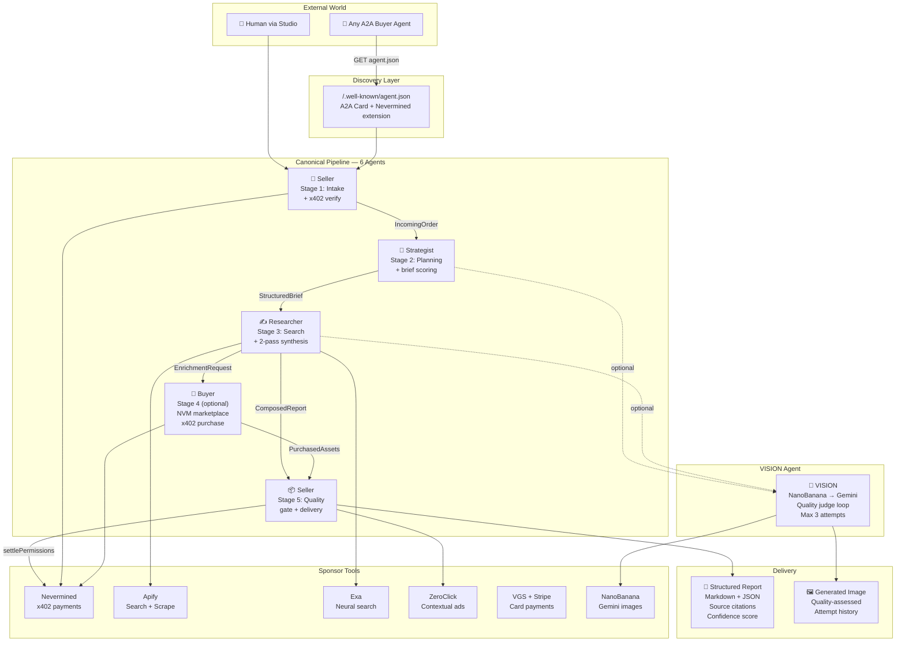

<div align="center">

# UNDERMIND

### Autonomous Agent Economy — Built on Nevermined

> **6 specialized AI agents that plan, research, trade, generate images, and settle payments — all autonomously.**

[](https://nevermined-autonomous-business-hack.vercel.app)
[](https://nevermined-autonomous-business-hack.vercel.app/.well-known/agent.json)
[](https://nevermined.app)

**Autonomous Business Hackathon** · March 5–6, 2026

</div>

---

## Architecture



---

## 🏆 Sponsor Tools & Integrations

Every sponsor tool is deeply woven into the agent pipeline — not bolted on, but essential to how the system operates.

| Sponsor | Integration | Role in the Pipeline |
|:--------|:------------|:---------------------|
| **Nevermined** | x402 Payments SDK | The economic backbone. Every external API call goes through `verify → execute → settle`. Plan checkout, credit burning, A2A discovery via `agent.json`. Buyer agent purchases marketplace assets via x402. |
| **Apify** | Google Search Scraper + Website Content Crawler | The Researcher agent's primary eyes. Multi-query Google search discovers URLs, then Cheerio-based crawler extracts clean content for LLM synthesis. |
| **Exa** | Neural Search + Content Extraction | Alternative search path — semantic neural search returns full-text content inline. No separate scrape step needed. Auto-fallback when Apify is unavailable. |
| **ZeroClick** | Contextual Ads API | Serves relevant, non-intrusive contextual ads alongside research results. Revenue tracked in the Sponsor Proof Rail visible in the Studio UI. |
| **NanoBanana** | Gemini Image Generation | Powers the VISION agent — generates hero images with an iterative quality loop (GPT-4o-mini judge scores each attempt, refines prompt, max 3 tries). |
| **VGS + Stripe** | Tokenized Card Payments | PCI-compliant credit card processing — VGS vault tokenizes card data before it ever touches our server, Stripe processes the charge. |
| **Vercel** | Blob Storage + Hosting | Persists generated deliverables and images to durable Blob storage; hosts the live production deployment with edge functions. |

---

## 🤖 6 Agents, 2 Orchestration Layers

This isn't a single-agent wrapper. It's a **hierarchical multi-agent system** — orchestrators of orchestrators — like a corporate org chart where each agent has a specialized role.

```
User / External Buyer Agent
    │
    ▼
┌─────────────────────────────────────────────────────────┐
│  SELLER (Layer 1 — External Orchestrator)               │
│  Receives x402 order → AI plans fulfillment →           │
│  Delegates to internal pipeline                         │
│                                                         │
│  ┌───────────────────────────────────────────────────┐  │
│  │  PIPELINE (Layer 2 — Internal Orchestrator)       │  │
│  │                                                   │  │
│  │  ① Strategist ──▶ ② Researcher ──▶ ③ Buyer      │  │
│  │       ▲                │                │         │  │
│  │       └── back-loop ───┘                │         │  │
│  │       (buy more context)          NVM marketplace │  │
│  │                                                   │  │
│  │  ④ VISION (NanoBanana)   ⑤ Completeness Judge   │  │
│  │     hero image gen            QA evaluator        │  │
│  └───────────────────────────────────────────────────┘  │
│                                                         │
│  Settlement: verify x402 → execute → settle → deliver   │
└─────────────────────────────────────────────────────────┘
```

| # | Agent | What It Does | Key Autonomy |
|:-:|:------|:-------------|:-------------|
| ① | **Strategist** | Expands raw input into structured briefs with search queries, scope, deliverables | Self-scores output quality; regenerates if below threshold |
| ② | **Researcher** | Multi-source web search → scrape → 2-pass LLM synthesis → cited report | 5-path fallback chain (Exa → Apify → DDG → raw fetch) |
| ③ | **Buyer** | Discovers marketplace assets, ranks by value score, purchases within budget | Autonomous economic decisions with approval thresholds |
| ④ | **VISION** | Generates hero images via NanoBanana with quality judge loop | Reasons about failure and rewrites its own prompt |
| ⑤ | **Completeness Judge** | Evaluates if research is sufficient or needs more context | Triggers Researcher → Strategist back-loop for deeper coverage |
| ⑥ | **Seller** | External API boundary — intake, x402 settlement, delivery | AI-powered fulfillment planning decides what to buy/build |

---

## 💰 x402 Payment Flow

Every external API call is gated by Nevermined's x402 protocol. **No payment = no results.**

```
Buyer Agent              Nevermined                Undermind
    │                        │                         │
    │  GET /.well-known/agent.json ───────────────────▶│
    │◀─ planId, agentId, pricing ─────────────────────│
    │                        │                         │
    │  getX402AccessToken() ─▶                         │
    │◀─ accessToken ─────────│                         │
    │                        │                         │
    │  POST /api/agent/seller ─────────────────────────▶│
    │  (payment-signature: token)                      │
    │                        │  ① verifyPermissions() ─▶│
    │                        │◀── valid ───────────────│
    │                        │  ② [6 agents execute]   │
    │                        │  ③ settlePermissions() ─▶│
    │                        │◀── credits burned ──────│
    │◀─ 200 + DeliveryPackage ─────────────────────────│
```

> Credits are settled **after** execution but **before** results are returned. If settlement fails, the response is blocked with `402` — no free rides.

---

## 🎨 VISION Agent — NanoBanana

The VISION agent generates contextual hero images for every report:

```
Brief → Prompt Engineering → NanoBanana (Gemini 2.5 Flash) → Poll
    → Quality Assessment (GPT-4o-mini vision judge)
        → PASS (≥72/100): return image
        → FAIL (attempt < 3): refine prompt → retry
        → FAIL (attempt 3): return best + failure flag
```

- **Bounded cost:** max 72 credits (3 attempts × 24cr)
- **Self-correcting:** agent reasons about why the image failed and rewrites its own prompt
- **Quality gate:** 72/100 score required to pass assessment

---

## ⚡ Tech Stack

| Layer | Technology |
|:------|:-----------|
| **Framework** | Next.js 16 (App Router, edge-ready) |
| **Language** | TypeScript (strict) |
| **Styling** | Tailwind CSS v4 + Framer Motion |
| **Payments** | Nevermined SDK (`@nevermined-io/payments`) + x402 |
| **AI Models** | OpenAI GPT-4o · Google Gemini · Anthropic Claude (auto-selected) |
| **Search** | Apify Google Search + Crawler · Exa Neural Search · DuckDuckGo fallback |
| **Images** | NanoBanana (Gemini image models) + GPT-4o-mini quality judge |
| **Cards** | VGS Collect + Stripe |
| **Ads** | ZeroClick contextual ads |
| **Storage** | Vercel Blob (durable deliverable + image persistence) |

---

## 📁 Project Structure

```
src/
├── app/
│   ├── .well-known/agent.json/   # A2A agent card (Google A2A + Nevermined)
│   ├── api/
│   │   ├── agent/                # Seller, Buyer, Research, Context-Builder
│   │   ├── agents/vision/        # VISION agent — NanoBanana image loop
│   │   ├── pipeline/             # run, clarify, followup, extract-actions
│   │   ├── workspace/            # jobs, profile
│   │   └── vgs/                  # VGS + Stripe payment processing
│   ├── studio/                   # /studio — main agent UI
│   └── services/                 # /services — service catalog
├── lib/
│   ├── agent/                    # pipeline, strategist, researcher, buyer, seller
│   ├── agents/vision/            # VISION agent (NanoBanana + quality loop)
│   ├── nevermined/server.ts      # SDK init, x402 verify/settle
│   ├── ai/providers.ts           # Multi-provider LLM selector
│   ├── apify/                    # Google Search + Content Crawler
│   ├── exa/                      # Neural search
│   └── blob/storage.ts           # Vercel Blob persistence
└── components/
    ├── pages/                    # Studio, Store, Agents, Services
    ├── sections/                 # Hero, Agent Cards, FAQ, How-To-Buy
    └── ui/                       # Judge Mode, Sponsor Rail, VGS Checkout
```

---

## 🚀 Quick Start

```bash
npm install
cp env.template .env.local    # fill in API keys
npm run dev                   # http://localhost:3000
```

> Without any env vars the app runs in **demo mode** — full UI, full pipeline, no real payments charged.

---

## 🔑 Environment Variables

| Variable | Required | Description |
|:---------|:---------|:------------|
| `NVM_API_KEY` | Live mode | Nevermined API key |
| `NVM_ENVIRONMENT` | Live mode | `sandbox` or `live` |
| `NVM_PLAN_ID` | Live mode | Payment plan DID |
| `NVM_AGENT_ID` | Live mode | Registered agent DID |
| `NVM_SELLER_ENDPOINT` | Live mode | Full URL of seller API |
| `NEXT_PUBLIC_BASE_URL` | Live mode | Deployed app URL |
| `OPENAI_API_KEY` | **Yes** (one LLM required) | Primary LLM provider |
| `GOOGLE_AI_KEY` | Optional | Gemini fallback |
| `ANTHROPIC_API_KEY` | Optional | Claude fallback |
| `APIFY_API_TOKEN` | Optional | Apify search + scrape |
| `EXA_API_KEY` | Optional | Exa neural search |
| `NANOBANANA_API_KEY` | Optional | VISION image generation |
| `ZEROCLICK_API_KEY` | Optional | Contextual ads |
| `NEXT_PUBLIC_VGS_VAULT_ID` | Optional | VGS card collection |
| `STRIPE_SECRET_KEY` | Optional | Stripe backend |
| `BLOB_READ_WRITE_TOKEN` | Optional | Vercel Blob storage |

---

## 🌐 A2A Discovery

Our agent card at `/.well-known/agent.json` follows the Google A2A spec with Nevermined x402 extension:

- Per-agent `inputSchema`, `outputSchema`, and `examples`
- Skill tags, rate limits, error codes
- VISION agent capability declaration

```bash
curl https://nevermined-autonomous-business-hack.vercel.app/.well-known/agent.json
```

> Any A2A-compatible buyer agent can autonomously discover, negotiate, pay, and receive deliverables — zero human involvement.

---

## 🔨 Build & Deploy

```bash
npm run build    # type-check + production build
npm start        # serve locally
```

Pushes to `main` auto-deploy via Vercel.

---

<div align="center">

### Links

[Live Demo](https://nevermined-autonomous-business-hack.vercel.app) · [Agent Card](https://nevermined-autonomous-business-hack.vercel.app/.well-known/agent.json) · [Nevermined](https://nevermined.app) · [Nevermined Docs](https://docs.nevermined.app) · [NanoBanana](https://nanobnana.com) · [x402 Protocol](https://docs.cdp.coinbase.com/x402/welcome)

**Built with ❤️ for the Autonomous Business Hackathon**

</div>
